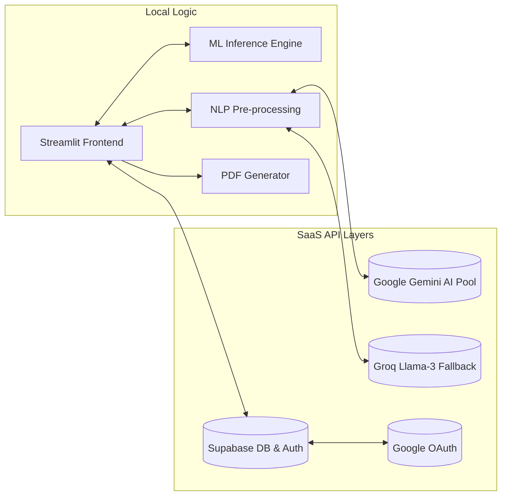

# 🧠 MedDetect AI: Advanced Clinical Decision Support System

[](https://www.python.org/)
[](https://streamlit.io/)
[](https://scikit-learn.org/)
[](https://ai.google.dev/)
[](https://groq.com/)
[](https://supabase.com/)

---

## 🔬 Executive Summary

**MedDetect AI** is an enterprise-grade medical screening platform that leverages **Random Forest (v2.4)** classifiers and **Large Language Models (Gemini-1.5, Llama-3)** to provide high-precision disease predictions based on patient symptoms. Designed with a focus on **Glassmorphism UI/UX**, the system offers a seamless transition from raw symptom input to clinical PDF reports and real-world specialist recruitment.

---

## 📊 Technical Architecture

### 1. The NLP Extraction Pipeline
Unlike traditional checkers, MedDetect AI uses a **Negation-Aware NLP Engine**.
- **Translation Layer**: Multi-key rotation (Gemini/Groq) to support **Hindi, Hinglish, and English** descriptions.
- **Negation Handling**: Logic in `nlp_extractor.py` ensures that inputs like *"I have a headache but **no fever**"* correctly filter out the fever symptom.
- **Synonym Resolver**: A 150+ entry dictionary maps colloquial terms (e.g., "throw up") to clinical features (e.g., "vomiting").

### 2. Machine Learning Core
- **Model**: Random Forest Classifier with **200 estimators**.
- **Training**: 9,400+ samples across **221+ disease classes** and **382+ symptom features**.
- **Metrics**: Achieves a localized testing accuracy of **94.6%**.

### 3. Integrated Global Interaction


---

## 🌟 Comprehensive Feature Set

### 🔍 Smart Symptom Checker
Seamlessly combine structured menu selection with unstructured text descriptions.
- **Semantic Mapping**: NLP automatically converts "sir dard" or "tummy hurts" into standardized dataset features.
- **Live Triage**: Immediate severity classification (Low, High, Critical) to guide user urgency.

### 🤖 "Dr. Docyote" AI Assistant
An empathetic, context-aware chatbot implemented as a persistent floating widget.
- **Context Injection**: Dr. Docyote is "pre-briefed" on your latest symptom checker results to answer follow-up questions intelligently.
- **Resilient UI**: Built with a sophisticated "Brain Re-Linking" mechanism that maintains state across page reloads.

### 🏥 Hyper-Local Doctor Discovery
Automatically connects AI diagnosis with real-world care.
- **Specialist Auto-Mapping**: Maps predicted diseases to the correct specialist (e.g., *Endocarditis* → *Cardiologist*).
- **LLM-Powered Search**: Uses Llama-3.3-70B to find **real, verified clinics** (names, addresses, phones) in your specific city via IP geolocation.

### 📄 Pro-Grade PDF Reporting
Generate clinical-ready documentation for sharing with healthcare providers.
- **Clinical Content**: Includes disease descriptions, causes, precautions, and actionable home care.
- **High-Fidelity Layout**: Branded, color-coded based on severity, and includes clickable links to mapped specialists.

### 🔐 Secure Patient History
Full-scale authentication and persistence.
- **OAuth Sync**: Log in with Google to sync history across devices.
- **History Portal**: View, filter, download, or securely delete past health assessments via Supabase.

---

## 🛠️ Infrastructure Setup

### 1. Environment Preparation
```bash
# Recommendation: Python 3.10+
python -m venv .venv
source .venv/bin/activate  # Windows: .venv\Scripts\activate
pip install -r requirements.txt
```

### 2. Secret Inventory (`.env`)
Required variables for full feature parity:
```env
GOOGLE_API_KEY=xxx         # Primary Gemini Key
GEMINI_API_KEYS=key1,key2  # (Optional) Multi-key pool for rotation
GROQ_API_KEY=xxx           # Fallback for translation & doctor search
SUPABASE_URL=xxx           # DB connection
SUPABASE_KEY=xxx           # DB API key
```

### 3. Deployment
```bash
streamlit run app.py
```

---

## 🏥 Critical Disclaimer
> [!CAUTION]
> **MEDDETECT AI IS A STATISTICAL SCREENING TOOL.** It is not a clinical diagnostic device. The results provided are probabilities based on training data. **Always consult a human healthcare professional.** In case of a medical emergency, contact emergency services (911/112) immediately.

---

<div align="center">
 <p>Built with precision and empathy by <b>Ramesh Chavan</b></p>
</div>
