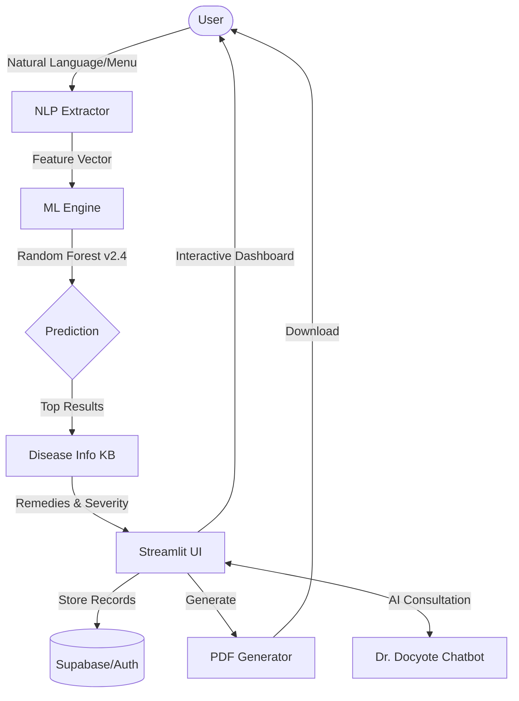

# 🧠 MedDetect AI — Multi-Disease Detection System

<div align="center">
  
  
  
  
</div>

---

## 🌟 Overview

**MedDetect AI** is a cutting-edge clinical decision support system designed to bridge the gap between initial symptoms and actionable medical insights. Powered by a **Random Forest** machine learning classifier and **Google's Gemini AI**, the platform offers a premium, high-fidelity user experience for healthcare screening.

It analyzes over **382+ distinct symptoms** to predict more than **221+ diseases** with high precision.

---

## 🚀 Key Features

- **🔬 Smart Symptom Analysis**: Input symptoms via selection or natural language. The system extracts medical keywords using a custom NLP engine.
- **🤖 ML Prediction Engine**: A Random Forest model (v2.4) trained on 9,400+ clinical samples provides prioritized diagnoses with confidence intervals.
- **💬 Dr. Docyote (Gemini AI)**: A context-aware chatbot that acts as an initial medical assistant, answering health-related queries with empathy.
- **🛡️ Severity & Risk Assessment**: Real-time risk scoring for conditions, flagging "Critical" or "High" risk alerts for emergency conditions.
- **📄 Professional PDF Reports**: Instantly generate clinical reports containing predictions, precautions, and specialist recommendations.
- **🏥 Clinic Locator**: Find nearby specialists based on predicted conditions (Cardiologists, Neurologists, etc.).
- **🔐 Secure Authentication**: Integrated with Google OAuth and Supabase for persistent health history tracking.

---

## 📊 Data Flow Diagram



---

## 📂 Project Architecture

### 📁 Root Files
- [app.py](file:///d:/DSP/app.py): The main landing page and global UI configuration.
- [.env](file:///d:/DSP/.env): Secrets and API keys (Gemini, Supabase, Google OAuth).
- [requirements.txt](file:///d:/DSP/requirements.txt): Environment dependencies.

### 📁 `/modules` — Core Logic
| Module | Description |
| :--- | :--- |
| `ml_engine.py` | Model loading, feature engineering, and inference logic. |
| `nlp_extractor.py` | Converts text or speech into structured symptom lists. |
| `disease_info.py` | Huge KB containing descriptions, causes, and specialists for 220+ diseases. |
| `pdf_generator.py` | High-fidelity PDF reporting system using FPDF. |
| `floating_chat.py` | Real-time "Dr. Docyote" interface using Gemini-1.5-Pro. |
| `database.py` | Connectivity to Firebase/Supabase for report storage. |
| `doctor_locator.py` | Google Maps integration for finding local clinics. |
| `shared_ui.py` | Reusable UI components (Glassmorphism containers, custom footers). |

### 📁 `/pages` — Navigation
- `0_🔑_Sign_In.py`: Authentication portal.
- `1_🔍_Symptom_Checker.py`: Primary diagnostic tool.
- `2_📊_Report_History.py`: User session history and file downloads.
- `3_👨‍⚕️_Book_Appointment.py`: Clinic locator and scheduling helper.

### 📁 `/models`
- `trained_model_v2.4.pkl`: The current production-ready Random Forest model.
- `train_model.py`: Script to retrain the model on new datasets.
- `metadata.json`: Model version, accuracy metrics, and class mappings.

---

## 🛠️ Installation & Setup

### 1. Clone & Set Up Environment
```bash
git clone https://github.com/rameshchavan07/Disease-Detection-System.git
cd Disease-Detection-System
python -m venv .venv
source .venv/bin/scripts/activate  # On Windows: .venv\Scripts\activate
pip install -r requirements.txt
```

### 2. Configure Environment Variables
Create a `.env` file in the root directory:
```env
GOOGLE_API_KEY=your_gemini_key
SUPABASE_URL=your_supabase_url
SUPABASE_KEY=your_supabase_key
GOOGLE_CLIENT_ID=your_oauth_id
```

### 3. Run the Application
```bash
streamlit run app.py
```

---

## 🏥 Medical Disclaimer
> [!WARNING]
> This system is for **informational and educational purposes only**. It does NOT replace professional medical advice, diagnosis, or treatment. Always seek the advice of a qualified healthcare provider for any medical concerns. **In case of an emergency, call your local emergency services (911/112) immediately.**

---

<div align="center">
  <p>Made with ❤️ by <b>Ramesh Chavan</b> & AI</p>
</div>
