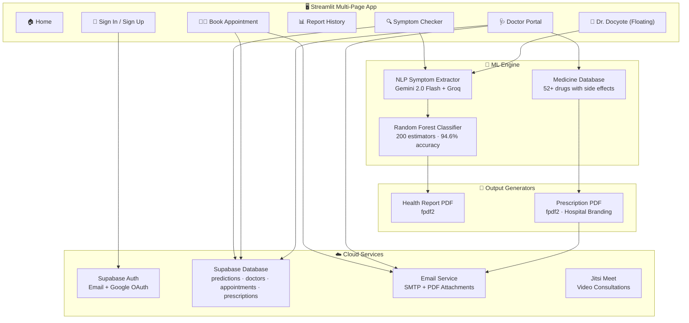

<div align="center">

# 🧠 MedDetect AI

### AI-Powered Multi-Disease Detection & Healthcare Management Platform

[](https://python.org)
[](https://streamlit.io)
[](https://supabase.com)
[](https://ai.google.dev)
[]()

**A full-stack health-tech platform** combining Random Forest ML disease prediction, NLP symptom extraction, AI chatbot consultation, video telemedicine, digital prescriptions with PDF generation, and a dual-role (Patient + Doctor) portal — all wrapped in a premium glassmorphism UI.

[🚀 Quick Start](#-quick-start) · [✨ Features](#-features) · [🏗️ Architecture](#️-architecture) · [📁 Project Structure](#-project-structure) · [🛠️ Tech Stack](#️-tech-stack)

</div>

---

## ✨ Features

### 🔍 Patient Platform

| Feature | Description |
|---|---|
| **Smart Symptom Checker** | Select from 382+ symptoms with auto-suggestions, or describe how you feel in plain English (or Hindi). NLP engine extracts structured symptoms automatically. |
| **ML Disease Prediction** | Random Forest classifier (200 estimators) trained on 9,400+ samples predicts diseases across 221+ conditions with confidence scores. |
| **Severity Assessment** | Color-coded risk levels (Low 🟢 / Moderate 🟡 / High 🔴 / Critical 🚨) with emergency alerts for critical conditions. |
| **PDF Health Reports** | Downloadable comprehensive reports with predictions, precautions, and treatment suggestions. Can be emailed directly. |
| **Report History** | Cloud-saved prediction history with trend analysis, filterable by date and disease. |
| **Doctor Booking** | Search and book appointments with registered doctors by specialty. Includes Jitsi Meet video consultation links. |
| **Appointment Email** | Automatic email confirmations with meeting links sent on booking. |

### 🩺 Doctor Platform

| Feature | Description |
|---|---|
| **Doctor Registration** | Full professional registration with hospital name, address, specialty, and contact information. |
| **Appointment Dashboard** | Real-time dashboard showing today's, upcoming, and past appointments with patient email and status. |
| **Patient History Access** | View patient's recent AI symptom reports directly from the appointment card before consultation. |
| **Smart Prescription Builder** | Searchable medicine database (52+ drugs) with real-time autocomplete. Selecting a medicine auto-displays dosage, side effects, contraindications, and drug interactions. |
| **Multi-Medicine Prescriptions** | Add/remove multiple medicines per prescription with individual dosage, frequency, and duration fields. |
| **Professional PDF Prescriptions** | Hospital-branded PDF with Rx header, doctor info, patient details, structured medicines table, drug safety information, doctor's notes, and digital signature block. |
| **Prescription Email with PDF** | One-click email delivery with the generated PDF attached to the patient's email. |
| **Video Consultations** | Jitsi Meet integration for secure video calls directly from the dashboard. |

### 🤖 AI Assistant

| Feature | Description |
|---|---|
| **Dr. Docyote Chatbot** | Floating AI medical chatbot available on every page. Powered by Gemini 2.0 Flash with Groq Llama-3.3 fallback. |
| **Context-Aware** | Automatically receives symptom check results for intelligent follow-up conversation. |
| **Multilingual** | Responds in the user's language; supports Hindi/Hinglish symptom input. |
| **Rate-Limit Resilient** | Dual-engine architecture with API key rotation pool for uninterrupted availability. |

---

## 🏗️ Architecture



---

## 📁 Project Structure

```
MedDetect-AI/
├── app.py                          # Main entry point & home page
├── config/
│   └── settings.py                 # Environment config, paths, API keys
├── pages/
│   ├── 0_🔑_Sign_In.py            # Authentication (Email + Google OAuth)
│   ├── 1_🔍_Symptom_Checker.py    # Symptom input & disease prediction
│   ├── 2_📊_Report_History.py     # Saved predictions & trend analysis
│   ├── 3_👨‍⚕️_Book_Appointment.py # Doctor search & appointment booking
│   └── 4_🩺_Doctor_Portal.py      # Doctor dashboard & prescription builder
├── modules/
│   ├── ml_engine.py                # Model loading & disease prediction
│   ├── nlp_extractor.py            # NLP symptom extraction + translation
│   ├── database.py                 # Supabase client & all CRUD operations
│   ├── medicine_db.py              # Curated medicine database (52+ drugs)
│   ├── prescription_pdf.py         # Professional prescription PDF generator
│   ├── pdf_generator.py            # Health report PDF generator
│   ├── email_service.py            # SMTP email (reports, appointments, Rx)
│   ├── disease_info.py             # Disease descriptions & remedies
│   ├── floating_chat.py            # Dr. Docyote AI chatbot widget
│   ├── shared_ui.py                # Shared CSS injection & sidebar renderer
│   ├── doctor_locator.py           # Doctor search utilities
│   └── logger.py                   # Structured logging configuration
├── models/
│   ├── train_model.py              # Model training script
│   ├── trained_model_v2.4.pkl      # Serialized Random Forest model (~2GB)
│   └── metadata.json               # Model version & accuracy metrics
├── data/
│   └── dataset.csv                 # Training dataset (9,400+ samples)
├── assets/
│   └── doctor_avatar.png           # Dr. Docyote chatbot avatar
├── notebooks/                      # Jupyter notebooks for analysis
├── .env                            # Environment variables (not committed)
├── requirements.txt                # Python dependencies
└── README.md                       # This file
```

---

## 🛠️ Tech Stack

| Layer | Technology | Purpose |
|---|---|---|
| **Frontend** | Streamlit 1.55 | Multi-page reactive web app |
| **ML Model** | scikit-learn (Random Forest) | Disease classification |
| **NLP** | Google Gemini 2.0 Flash | Symptom extraction & translation |
| **Fallback LLM** | Groq (Llama-3.3-70B) | Backup NLP & chatbot engine |
| **Auth** | Supabase Auth | Email/password + Google OAuth |
| **Database** | Supabase (PostgreSQL) | Predictions, doctors, appointments, prescriptions |
| **PDF** | fpdf2 | Health reports & prescription documents |
| **Email** | smtplib | Reports, appointment confirmations, prescriptions |
| **Video** | Jitsi Meet | Telemedicine video consultations |
| **UI Theme** | Custom CSS | Glassmorphism dark theme with Plus Jakarta Sans |

---

## 🚀 Quick Start

### Prerequisites

- Python 3.12+
- Supabase account (free tier works)
- Gemini API key ([Get one here](https://ai.google.dev))

### 1. Clone & Install

```bash
git clone https://github.com/rameshchavan07/Disease-Detection-System.git
cd Disease-Detection-System
python -m venv .venv
.venv\Scripts\activate        # Windows
# source .venv/bin/activate   # macOS/Linux
pip install -r requirements.txt
```

### 2. Configure Environment

Create a `.env` file in the project root:

```env
# Supabase
SUPABASE_URL=https://your-project.supabase.co
SUPABASE_KEY=your-anon-key

# AI / NLP
GEMINI_API_KEY=your-gemini-api-key
GEMINI_API_KEYS=key1,key2,key3          # Optional: multi-key rotation pool
GROQ_API_KEY=your-groq-api-key          # Optional: fallback LLM

# Email (Optional — simulated if not set)
SMTP_SERVER=smtp.gmail.com
SMTP_PORT=587
SMTP_USER=your-email@gmail.com
SMTP_PASSWORD=your-app-password
```

### 3. Database Setup (Supabase)

Create these tables in your Supabase dashboard:

```sql
-- Predictions
CREATE TABLE predictions (
    id UUID DEFAULT gen_random_uuid() PRIMARY KEY,
    user_id TEXT NOT NULL,
    symptoms TEXT[] NOT NULL,
    predicted_disease TEXT,
    confidence FLOAT,
    created_at TIMESTAMPTZ DEFAULT NOW()
);

-- Doctors
CREATE TABLE doctors (
    id UUID DEFAULT gen_random_uuid() PRIMARY KEY,
    user_id TEXT NOT NULL UNIQUE,
    name TEXT NOT NULL,
    email TEXT NOT NULL,
    specialty TEXT NOT NULL,
    phone TEXT,
    city TEXT,
    hospital_name TEXT,
    hospital_address TEXT,
    created_at TIMESTAMPTZ DEFAULT NOW()
);

-- Appointments
CREATE TABLE appointments (
    id UUID DEFAULT gen_random_uuid() PRIMARY KEY,
    patient_id TEXT NOT NULL,
    patient_email TEXT NOT NULL,
    doctor_id UUID REFERENCES doctors(id),
    doctor_name TEXT NOT NULL,
    specialty TEXT NOT NULL,
    appointment_date DATE NOT NULL,
    appointment_time TIME NOT NULL,
    meeting_url TEXT NOT NULL,
    status TEXT DEFAULT 'upcoming',
    created_at TIMESTAMPTZ DEFAULT NOW()
);

-- Prescriptions
CREATE TABLE prescriptions (
    id UUID DEFAULT gen_random_uuid() PRIMARY KEY,
    appointment_id UUID REFERENCES appointments(id),
    doctor_id UUID REFERENCES doctors(id),
    patient_id TEXT NOT NULL,
    patient_email TEXT NOT NULL,
    diagnosis TEXT NOT NULL,
    medicines TEXT[],
    notes TEXT,
    created_at TIMESTAMPTZ DEFAULT NOW()
);
```

### 4. Run

```bash
streamlit run app.py
```

The app opens at `http://localhost:8501`. On first boot, the ML model trains automatically (~5 seconds).

---

## 📊 ML Model Details

| Metric | Value |
|---|---|
| **Algorithm** | Random Forest Classifier |
| **Estimators** | 200 |
| **Training Samples** | 9,400+ |
| **Diseases Covered** | 221+ |
| **Symptoms Recognized** | 382+ |
| **Test Accuracy** | 94.6% |
| **Cross-Validation** | 5-fold |
| **Feature Encoding** | Binary symptom vector |
| **Model Size** | ~2 GB (serialized with joblib) |

---

## 💊 Medicine Database

The built-in medicine database covers **52 medicines** across 18 therapeutic categories:

| Category | Example Medicines |
|---|---|
| Analgesic / Antipyretic | Paracetamol |
| NSAID | Ibuprofen, Diclofenac, Naproxen, Aspirin |
| Antibiotic | Amoxicillin, Azithromycin, Ciprofloxacin, Doxycycline, Cephalexin, Metronidazole |
| PPI / GI | Omeprazole, Pantoprazole, Domperidone, Ondansetron |
| Cardiovascular | Amlodipine, Atenolol, Losartan, Enalapril, Atorvastatin, Clopidogrel |
| Antidiabetic | Metformin, Glimepiride |
| Respiratory | Salbutamol, Montelukast, Cetirizine, Fexofenadine |
| Corticosteroid | Prednisolone, Dexamethasone |
| Supplements | Vitamin D3, B12, Iron, Calcium |
| Neurological | Gabapentin, Amitriptyline, Tramadol |

Each entry includes: generic name, form, common dosage, max daily dose, side effects, contraindications, and drug interactions.

---

## ⚠️ Medical Disclaimer

> This system is for **informational and educational purposes only**. It does **NOT** replace professional medical advice, diagnosis, or treatment. Always seek the advice of a qualified healthcare provider with any questions regarding a medical condition. In case of emergency, call your local emergency services immediately.

---

## 📄 License

This project is developed for educational and academic purposes.

---

<div align="center">

**Built with ❤️ and AI for better health awareness**

MedDetect AI v2.0 • Powered by Machine Learning & Google Gemini API
Designed and Developed by Ramesh Chavan

</div>
